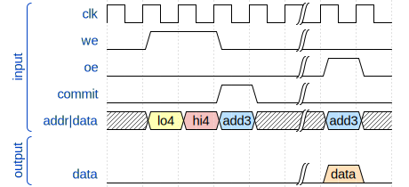

  

# Tiny Tapeout SRAM

Tiny Tapeout #1 included a 4-bit CPU, a 6-bit CORDIC, an FPGA, and other tiny
circuits.  It seemed like an SRAM was missing, so this is my attempt to remedy
that in Tiny Tapeout #2.

## Circuit Logic

The circuit in this repository has a 4-bit address/data input and 8-bit output.
Due to circuit area limitations, only 8 bytes are addressable.  There are three
modes: Write, Output, and Commit.  The diagram below demonstrates how to write
and read from memory.  Because there are only eight pins for input and four of
the pins are used for signaling, the remaining four input pins define the data
and address over three cycles.  The high bit of the address is ignored.  Commit
will set the internal shift register value to memory at the address provided.

[WaveDrom](https://wavedrom.com/editor.html?%7Bsignal%3A%20%5B%5B%27input%27%2C%0A%20%20%7Bname%3A%20%20%20%20%20%20%20%27clk%27%2C%20wave%3A%20%27p....%7C..%27%7D%2C%0A%20%20%7Bname%3A%20%20%20%20%20%20%20%20%27we%27%2C%20wave%3A%20%2701.0.%7C..%27%7D%2C%0A%20%20%7Bname%3A%20%20%20%20%20%20%20%20%27oe%27%2C%20wave%3A%20%270....%7C10%27%7D%2C%0A%20%20%7Bname%3A%20%20%20%20%27commit%27%2C%20wave%3A%20%270..10%7C..%27%7D%2C%0A%20%20%7Bname%3A%20%27addr%7Cdata%27%2C%20wave%3A%20%27x395x%7C5x%27%2C%20data%3A%20%5B%27lo4%27%2C%20%27hi4%27%2C%20%27add3%27%2C%20%27add3%27%5D%7D%2C%0A%20%20%5D%2C%5B%27output%27%2C%7B%7D%2C%0A%20%20%7Bname%3A%20%20%20%20%20%20%27data%27%2C%20wave%3A%20%270....%7C40%27%2C%20data%3A%20%5B%27data%27%5D%7D%0A%20%20%5D%5D%2C%0A%7D)

## What is Tiny Tapeout?

TinyTapeout is an educational project that aims to make it easier and cheaper
than ever to get your digital designs manufactured on a real chip!

Go to https://tinytapeout.com for instructions!
