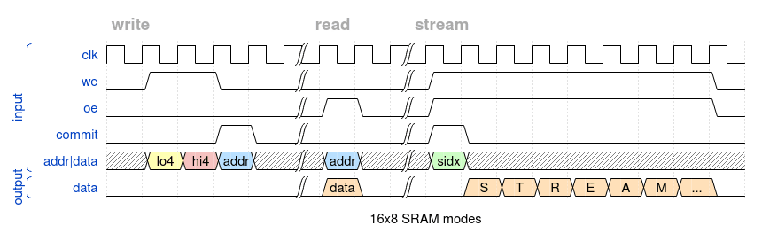

  

# Tiny Tapeout SRAM & Streaming Signal Generator

Tiny Tapeout #1 included a 4-bit CPU, a 6-bit CORDIC, an FPGA, and other tiny
circuits.  It seemed like an SRAM was missing, so this is my attempt to remedy
that in Tiny Tapeout #2. This circuit also has an additional feature to stream
internal data without continuously updating the address, enabling use as a
signal generator.

## Circuit Logic

The circuit in this repository has a 4-bit address/data input and 8-bit output.
Due to circuit area limitations and input width, only 16 bytes are addressable.
There are three modes: Write, Read, and Stream.  The diagram below demonstrates
how to use the SRAM in each mode.  Because there are only eight pins for input
and four of the pins are used for signaling, the remaining four input addr/data
pins define the data and address over three cycles.  Commit will set the
internal shift register value to memory at the address provided, or when using
the Stream mode, set the starting index or address to stream from.

[WaveDrom](https://wavedrom.com/editor.html?%7B%0A%20%20signal%3A%20%5B%5B%27input%27%2C%0A%20%20%7Bname%3A%20%20%20%20%20%20%20%27clk%27%2C%20wave%3A%20%27p....%7C..%7C.........%27%7D%2C%0A%20%20%7Bname%3A%20%20%20%20%20%20%20%20%27we%27%2C%20wave%3A%20%2701.0.%7C..%7C1.......0%27%7D%2C%0A%20%20%7Bname%3A%20%20%20%20%20%20%20%20%27oe%27%2C%20wave%3A%20%270....%7C10%7C1.......0%27%7D%2C%0A%20%20%7Bname%3A%20%20%20%20%27commit%27%2C%20wave%3A%20%270..10%7C..%7C10.......%27%7D%2C%0A%20%20%7Bname%3A%20%27addr%7Cdata%27%2C%20wave%3A%20%27x395x%7C5x%7C7x.......%27%2C%20data%3A%20%5B%27lo4%27%2C%20%27hi4%27%2C%20%27addr%27%2C%20%27addr%27%2C%27sidx%27%5D%7D%2C%0A%20%20%5D%2C%5B%27output%27%2C%0A%20%20%7Bname%3A%20%20%20%20%20%20%27data%27%2C%20wave%3A%20%270....%7C40%7C.44444440%27%2C%20data%3A%20%5B%27data%27%2C%20%27S%27%2C%27T%27%2C%27R%27%2C%27E%27%2C%27A%27%2C%27M%27%2C%27...%27%5D%7D%0A%20%20%5D%5D%2C%0A%20%20head%3A%20%7Btext%3A%0A%20%20%5B%27tspan%27%2C%0A%20%20%20%20%5B%27tspan%27%2C%20%7Bclass%3A%27muted%20h4%27%7D%2C%20%27write%27%5D%2C%0A%20%20%20%20%5B%27tspan%27%2C%20%7Bclass%3A%27muted%20h4%27%7D%2C%20%27%20%20%20%20%20%20%20%20%20%20%20%20%20%20%20%20%20%20%20%20%20%20%20%20%20%20%20%20%20%20%20%20%20%20%20%20read%20%20%20%20%20%20%20%20%20%20%20%20%20%20%27%5D%2C%0A%20%20%20%20%5B%27tspan%27%2C%20%7Bclass%3A%27muted%20h4%27%7D%2C%20%27stream%20%20%20%20%20%20%20%20%20%20%20%20%20%20%20%20%20%20%20%20%20%20%20%20%20%20%20%20%20%20%20%20%20%20%20%20%20%20%20%20%20%20%20%20%20%20%20%20%20%20%20%20%20%20%20%20%20%20%20%27%5D%0A%20%20%5D%7D%2C%0A%20%20foot%3A%20%7Btext%3A%0A%20%20%5B%27tspan%27%2C%20%2716x8%20SRAM%20modes%27%5D%7D%0A%7D)

## What is Tiny Tapeout?

TinyTapeout is an educational project that aims to make it easier and cheaper
than ever to get your digital designs manufactured on a real chip!

Go to https://tinytapeout.com for instructions!
